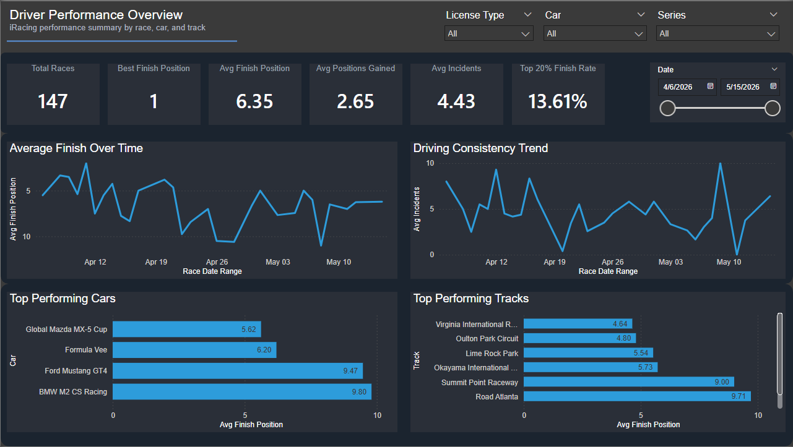
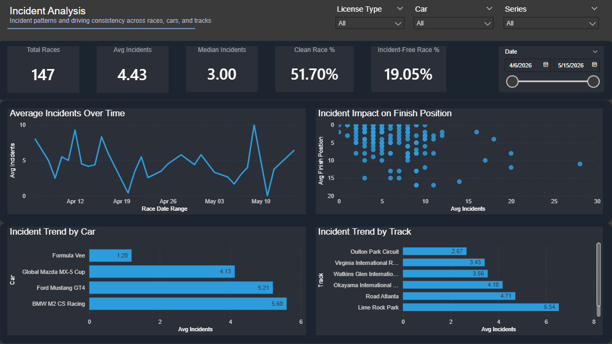

# Sim Racing Analytics Pipeline

## Overview

This project processes and analyzes personal iRacing race data using a Python-based ETL and analytics workflow.

The project simulates a real-world data pipeline by ingesting race exports, transforming session data into structured datasets, storing results in SQLite, and generating analytical insights through SQL and Power BI dashboards.

The project focuses on data engineering fundamentals, analytical querying, dashboard design, and end-to-end workflow organization using motorsport race data.

## Tech Stack

- Python
- pandas
- SQLite
- SQL
- JSON / CSV processing
- Power BI
- Git / GitHub

## Dashboard Preview

### Driver Performance Overview

### Incident Analysis

## Pipeline Architecture

Raw Race Exports
→ Python Cleaning & Transformation
→ Processed Analytical CSVs
→ SQLite Database
→ SQL Queries
→ Power BI Dashboards

## Features

- Data cleaning and transformation
- Duplicate prevention using `subsession_id`
- Incremental database loading
- Track normalization
- Dashboard filtering and KPI reporting
- Trend analysis across races, cars, and tracks
- Modular ETL workflow

## Key Skills Demonstrated

- ETL workflow development
- Data transformation with pandas
- Relational database design
- SQL querying and aggregation
- Dashboard development in Power BI
- Data storytelling and visualization

## Future Improvements

- API-based automated ingestion
- Additional telemetry metrics
- Expanded SQL analysis library
- Performance prediction modeling

## Documentation

Additional documentation:

- Pipeline workflow diagrams
- Database schema
- Dashboard PDFs

See `/documentation`
